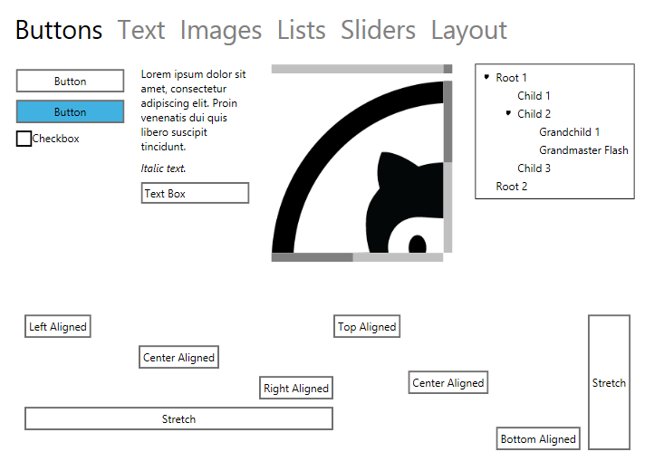

# Perspex #

...a next generation WPF?

## Background ##

As everyone who's involved in client-side .NET development knows, the past half decade have been a 
very sad time. Where WPF started off as a game-changer, it now seems to have been all but forgotten.
WinRT came along and took many of the lessons of WPF but it's currently not usable on the desktop.

After a few months of trying to reverse-engineer WPF with the [Avalonia Project](https://github.com/grokys/Avalonia) I began to come to the same conclusion that I imagine Microsoft
came to internally: for all its groundbreaking-ness at the time, WPF at its core is a dated mess,
written for .NET 1 and barely updated to even bring it up-to-date with .NET 2 features such as
generics.

So I began to think: what if we were to start anew with modern C# features such as *(gasp)* 
Generics, Observables, async, etc etc. The result of that thought is Perspex.

##### DISCLAIMER
This is really early development pre-alpha-alpha stuff. Everything is subject to 
change, I'm not even sure if the performance characteristics of Rx make Observables suitable for 
binding throughout a framework. *I'm writing this only to see if the idea of exploring these ideas 
appeals to anyone else.*

## Documentation
As mentioned above this is really an early version of Perspex and we're working hard on improving the code base and the documentation at the same time. Please feel free to have a look at our [introduction document](Docs/intro.md) to get things started real quick. Contributions are always welcome!

## Building and Using
In order to build and use Perpex you need a compiler that supports the upcoming C# 6 features.

- **Visual Studio 2015 Preview**: The recommended way to compile C# 6 code is to use the new Visual Studio 2015 Preview version, which Microsoft has released later this year. It comes with the new Roslyn compiler and features like the new upcoming JIT (RyuJIT) and other improvements like extensible code analysis right out of the box. It can be downloaded [here](http://www.visualstudio.com/en-us/downloads/visual-studio-2015-downloads-vs)

- **Visual Studio 2013**: With the introduction of the new Roslyn compiler platform earlier this year Microsoft has released an *April End User Preview* which is a small extension that brings supports to Visual Studio 2013. 
  **NOTE**: This extension is **out of date** and will **no longer be updated**, according to the [Roslyn CodePlex](https://roslyn.codeplex.com/) main page. However, if you don't want to use a Preview IDE feel free to download the extension [over here](https://connect.microsoft.com/VisualStudio/Downloads/DownloadDetails.aspx?DownloadID=52793). It must be noted that it is not guaranteed that future versions of Perspex will compile and run when using this extension.

## Contributing ##

Please read the [contribution guidelines](Docs/contributing.md) before submitting a pull request.
