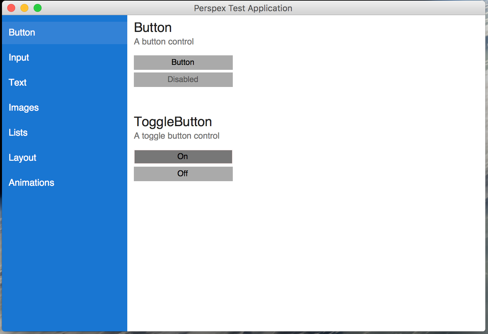

# Perspex

A multi-platform .NET UI framework.

## Background

Perspex is a multi-platform windowing toolkit - somewhat like WPF - that is
intended to be multi-platform (more about that below). It supports XAML,
lookless controls and a flexible styling system, and runs on Windows using
Direct2D and other operating systems using Gtk & Cairo.

## Current Status

Perspex is now in alpha. What does "alpha mean? Well, it means that it's now at a stage where you
can have a play and hopefully create simple applications. There's now a [Visual
Studio Extension](https://visualstudiogallery.msdn.microsoft.com/87db356c-cec9-4a07-b7db-a4ed8a921ac9)
containing project and item templates that will help you get started, and
there's an initial complement of controls. There's still a lot missing, and you
*will* find bugs, and the API *will* change, but this represents the first time
where we've made it somewhat easy to have a play and experiment with the
framework.

## Documentation

As mentioned above, Perspex is still in alpha and as such there's not much documentation yet. You can 
take a look at the [alpha release announcement](http://grokys.github.io/perspex/perspex-alpha/) for an 
overview of how to get started but probably the best thing to do for now is to already know a little bit about WPF/Silverlight/UWP/XAML and ask questions in our [Gitter room](https://gitter.im/grokys/Perspex).

There's also a high-level [architecture document](docs/architecture.md) that is currently a little bit
out of date, and I've also started writing blog posts on Perspex at http://grokys.github.io/.

Contributions are always welcome!

# Multi-platform you say?

Well, yes, that is the intention. However unfortunately as of the time of this
first alpha, Perspex is only shipping with a Windows backend. There *is* a
Gtk/Cairo backend that's working pretty well (at least on Windows) but it's not
included in this release due to packaging issues. In addition, the framework did
work on Linux at one point but with the recent Mono 4.0 something has gone
wrong, and we need time to work out what that is. Getting Perspex working again
on non-windows support is the next thing we'll be concentrating on. You can
track the progress on Linux in the [issue](https://github.com/grokys/Perspex/issues/78).

## Building and Using

In order to build Perpex under Windows you need a compiler that supports C# 6 such
as Visual Studio 2015. To compile the project under windows, you must have gtk-sharp 
installed. However, if you're not interested in building the cross-platform bits you 
can simply unload the Perspex.Cairo and Perspex.Gtk project in Visual Studio.

To build with mono (even though everything's not fully working as yet) check out the
[instructions here](docs/mono-build.md) and the [Linux issue](https://github.com/grokys/Perspex/issues/78).

## Contributing ##

Please read the [contribution guidelines](Docs/contributing.md) before submitting a pull request.
